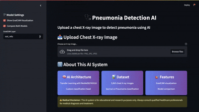

# Pneumonia Detection using Convolutional Neural Networks (CNN)

## Overview

This project aims to develop an automated system for detecting pneumonia from chest X-ray images using deep learning. Pneumonia is a potentially life-threatening condition, and early detection is crucial for effective treatment. By leveraging convolutional neural networks, the project demonstrates how artificial intelligence can enhance diagnostic accuracy and efficiency.

## Objective

- Build and evaluate a base CNN model for binary classification of chest X-ray images.
- Implement a second model using transfer learning with a pre-trained architecture.
- Combine both models using an ensemble method to compare performance across different approaches.
- Assess model performance using standard evaluation metrics such as accuracy, precision, recall, and F1-score.
- Develop an interactive web application using Streamlit that allows users to upload chest X-ray images and receive predictions, along with Grad-CAM visualizations highlighting regions of diagnostic interest.

## Dataset

The dataset used is the [Chest X-Ray Images (Pneumonia) dataset](https://www.kaggle.com/paultimothymooney/chest-xray-pneumonia), which includes labeled chest radiographs. It contains two classes:
- `NORMAL`
- `PNEUMONIA`

The data is divided into training, validation, and test sets.

## Features

- Image preprocessing and augmentation tailored for medical imaging.
- A custom base CNN architecture built from scratch.
- A second model utilizing transfer learning.
- An ensemble method combining predictions from both models to evaluate performance improvements.
- Visualization of training history and prediction metrics.
- Grad-CAM heatmaps to interpret and explain model predictions.
- Streamlit-based user interface to upload chest X-rays and get real-time diagnosis with visual feedback.

## Technologies Used

- Python
- TensorFlow / Keras
- Streamlit
- NumPy, Pandas
- Matplotlib, Seaborn
- scikit-learn

##  Project Directory Structure
```
pneumonia-detection-cnn/
│
├── app/
│   └── app.py
│
├── data/
│   └── chest_xray/
│       ├── train/
│       │   ├── NORMAL/
│       │   └── PNEUMONIA/
│       ├── val/
│       │   ├── NORMAL/
│       │   └── PNEUMONIA/
│       └── test/
│           ├── NORMAL/
│           └── PNEUMONIA/
│
├── notebooks/
│   ├── eda.ipynb
│   └── results.ipynb
│
├── outputs/
│   ├── best_model.keras
│   ├── best_transfer_model.keras
│   ├── training_history.json
│   ├── training_history_transfer.json
│   ├── accuracy_curve.png
│   ├── loss_curve.png
│   ├── accuracy_curve_transfer.png
│   ├── loss_curve_transfer.png
│   └── test_results.txt
│
├── src/
│   ├── data_loader.py
│   ├── model.py
│   ├── train.py
│   ├── transfer_train.py
│   ├── evaluate_models.py
│   └── visualization.py
│
│── media
├── .gitignore
├── requirements.txt
└── README.md
```
---

## Dataset Note

The dataset used in this project is **not included in this repository** due to size constraints.

You can download the chest X-ray dataset from Kaggle here:  
https://www.kaggle.com/datasets/paultimothymooney/chest-xray-pneumonia

After downloading:
1. Unzip the dataset.
2. Place the `chest_xray/` folder inside the `data/` directory of this project.
3. Ensure the structure matches the one shown above.


## How to Use

1. **Clone the repository:**
    ```bash
    git clone https://github.com/georgeTs19/pneumonia-detection-cnn.git
    cd pneumonia-detection-cnn
    ```

2. **Install the required dependencies:**
    ```bash
    pip install -r requirements.txt
    ```

3. **Exploratory Data Analysis (Optional but Recommended):**  
    Run the notebook:
    ```bash
    jupyter notebook notebooks/eda.ipynb
    ```
    **Expected Output:**  
    Visual insights into the dataset (e.g., image samples, class balance).

---

##  Train and Evaluate the Models

4. **Train the Base CNN Model:**
    ```bash
    python -m src.train
    ```
    **Expected Output:**  
    - `outputs/best_model.keras`  
    - `outputs/training_history.json`  
    - `outputs/accuracy_curve.png`, `outputs/loss_curve.png`

5. **Train the Transfer Learning Model:**
    ```bash
    python -m src.transfer_train
    ```
    **Expected Output:**  
    - `outputs/best_transfer_model.keras`  
    - `outputs/training_history_transfer.json`  
    - `outputs/accuracy_curve_transfer.png`, `outputs/loss_curve_transfer.png`

6. **Evaluate the Models:**
    ```bash
    python -m src.evaluate_models
    ```
    **Expected Output:**  
    - `outputs/test_results.txt`  
    - Comparison of model performances

7. **Visualize Training Results (Optional):**
    ```bash
    jupyter notebook notebooks/results.ipynb
    ```
    **Expected Output:**  
    - Insights from training history and evaluation

---

## Launch the Streamlit App

8. **Run the app:**
    ```bash
    streamlit run app/app.py
    ```
    **Expected Output:**  
    Interactive web interface for pneumonia detection from chest X-ray images

---

- Run all commands from the project root directory.

## Demo Previews

Below are sample outputs(gifs) of the model detecting pneumonia and normal chest X-rays:

### Pneumonia Case  


### Normal Case  


## License

This project is licensed under the MIT License.

## Disclaimer

This project is intended for **educational and research purposes only**. The models and predictions provided by this system **are not a substitute for professional medical advice, diagnosis, or treatment**. Do not use this tool for real-world clinical decisions. Always consult with a qualified healthcare provider for any health concerns or medical conditions.


